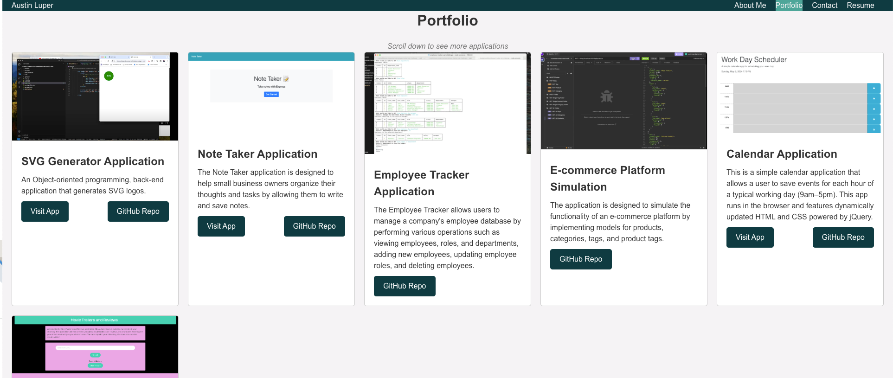

# react-portfolio-react-challenge

## Table of Contents
- [Description](#description)
- [User Story](#user-story)
- [Acceptance Criteria](#acceptance-criteria)
- [Installation](#installation)
- [Usage](#usage)
- [Screenshot](#screenshot)
- [Contributing](#contributing)
- [License](#license)
- [Technologies Used](#technologies-used)
- [Netlify URL](#netlify-url)
- [Credits](#credits)
- [Contact](#contact)

## Description
This assignment involves creating a React portfolio using Vite as the build tool. The portfolio will showcase a collection of projects with images, titles, links to deployed applications, and corresponding GitHub repositories, utilizing React components for efficient rendering and fast hot module replacement (HMR). It includes ESLint for code quality checks and maintains a clear folder structure for easy navigation and scalability.

## User Story
AS AN employer looking for candidates with experience building single-page applications
I WANT to view a potential employee's deployed React portfolio of work samples
SO THAT I can assess whether they're a good candidate for an open position

## Acceptance Criteria
GIVEN a single-page application portfolio for a web developer
WHEN I load the portfolio
THEN I am presented with a page containing a header, a section for content, and a footer
WHEN I view the header
THEN I am presented with the developer's name and navigation with titles corresponding to different sections of the portfolio
WHEN I view the navigation titles
THEN I am presented with the titles About Me, Portfolio, Contact, and Resume, and the title corresponding to the current section is highlighted
WHEN I click on a navigation title
THEN I am presented with the corresponding section below the navigation without the page reloading and that title is highlighted
WHEN I load the portfolio the first time
THEN the About Me title and section are selected by default
WHEN I am presented with the About Me section
THEN I see a recent photo or avatar of the developer and a short bio about them
WHEN I am presented with the Portfolio section
THEN I see titled images of six of the developer’s applications with links to both the deployed applications and the corresponding GitHub repository
WHEN I am presented with the Contact section
THEN I see a contact form with fields for a name, an email address, and a message
WHEN I move my cursor out of one of the form fields without entering text
THEN I receive a notification that this field is required
WHEN I enter text into the email address field
THEN I receive a notification if I have entered an invalid email address
WHEN I am presented with the Resume section
THEN I see a link to a downloadable resume and a list of the developer’s proficiencies
WHEN I view the footer
THEN I am presented with text or icon links to the developer’s GitHub and LinkedIn profiles, and their profile on a third platform (Stack Overflow, Twitter) 

## Screenshot

## Contributing
If you have suggestions or contributions to add, please follow the guidelines listed below. Pull requests will be reviewed in the order that they are received.
- Fork the repository.
- Create a new branch for your feature or bug fix.
- Make your changes and commit them.
- Push to the branch.
- Create a new Pull Request.

## License
This challenge is provided under the MIT License. See the [LICENSE](LICENSE) file for details.

## Technologies Used
React

CSS

JavaScript

Git/GitHub

## Netlify URL

Please click the following link to be taken to the Netlify deployment of this application:
 - https://organicclickreactportfolio.netlify.app/

## Credits
Development was assisted by the following resources:
 - Xpert Learning Assistant provided by the GWU Coding Boot Camp. Provided general guidance and assistance with Installation
   instructions and Usage instructions, and starting point for application description
 - Coolors used to create visually-interesting and professional color scheme for application (https://coolors.co/)
 - Referenced GWU Coding Boot Camp Module 20 - React section of materials and activities for initial file architecture and technologies to use (https://git.bootcampcontent.com/George-Washington-University/GWU-VIRT-FSF-PT-11-2023-U-LOLC/-/tree/main/20-React/01-Activities/28-Stu_Mini-Project?ref_type=heads)
 - Documentation referenced for use of React components and props (https://legacy.reactjs.org/docs/components-and-props.html)
 - Source of repositories to projects linked in this portfolio (https://github.com/OrganicClick?tab=repositories)
 - Mock-up in GWU Coding Boot Camp Module 20 Assignment Guidelines referenced for pages and components to create (https://bootcampspot.instructure.com/courses/4644/assignments/65718?module_item_id=1128217)
 - Referenced for creation of a "container file" to present each component/page (https://www.freecodecamp.org/news/separation-of-concerns-react-container-and-presentational-components/)
 - Referenced for how to change pages within React application (https://stackoverflow.com/questions/49649767/reactjs-how-do-you-switch-between-pages-in-react)
 - Referenced for how to keep a clicked navigation button highlighted (https://www.sitepoint.com/community/t/how-do-i-keep-a-clicked-navigation-button-highlighted/104751)
 - Referenced my own gist for implementing regex for determining what is a valid email address (https://gist.github.com/OrganicClick/28d61520a28a6f26997e042445f4dd77)
 - Post referenced for creating a Contact form for a React application (https://medium.com/@thomasaugot/create-a-react-contact-form-with-email-js-cad2c8606f33)
 - Referenced Final Group Project, which I contributed to, for file architecture, hooks, functions, and styling used (https://github.com/yaserhdev/get-fit)
 - Referenced for customizing server logic in vite config file (https://vitejs.dev/config/server-options)
 - Referenced this documentation for use of onBlur in React application (https://www.geeksforgeeks.org/react-onblur-event/)

## Contact
To contact the owner of this repo, OrganicClick, please reach out via OrganicClick@exampleemail.com